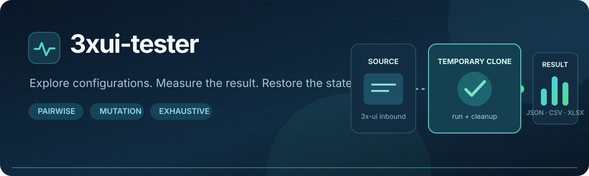
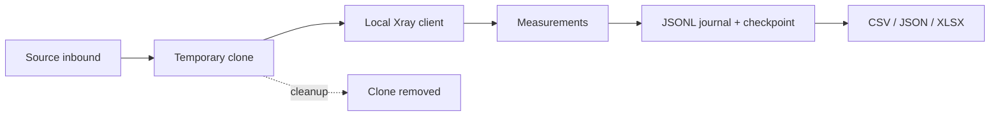

<p align="center">
  <a href="README.md">English</a> · <a href="README.ru_RU.md">Русский</a>
</p>

<p align="center">
  
</p>

<p align="center">
  <a href="https://github.com/OctoberIsTired/3xui-tester/actions/workflows/tests.yml"></a>
  
  
  
  
</p>

<p align="center">
  Test 3x-ui inbound configurations with a temporary clone, a local Xray client,
  repeatable measurements, and resumable results.
</p>

> [!NOTE]
> 3xui-tester is an independent tool for [3x-ui](https://github.com/MHSanaei/3x-ui).
> It is not part of the 3x-ui project.

## Why use it?

Changing a live inbound to compare transports and client settings is slow and
risky. 3xui-tester builds a bounded experiment, tests each candidate through a
local Xray client, and writes every result to a durable journal. The default
`clone` mode leaves the source inbound unchanged.

| Plan | Measure | Recover |
| --- | --- | --- |
| Pairwise coverage, exhaustive search, or adaptive mutation. | TCP, ICMP, HTTP latency and p95, stability, and optional bounded download speed. | Journal and checkpoint after each run; resume unfinished work and export JSON, CSV, or XLSX. |



## Quick start

For a complete step-by-step setup and first-run guide in Russian, see
[docs/START.ru_RU.md](docs/START.ru_RU.md).

You need Python 3.12+, [uv](https://docs.astral.sh/uv/), a local Xray binary,
access to the 3x-ui API, and a route from the test machine to the temporary
inbound. The adapter has been tested with 3x-ui v3.8.0 and Xray v26.9.9;
each run also checks the live panel's OpenAPI before changing an inbound.

```bash
git clone https://github.com/OctoberIsTired/3xui-tester.git
cd 3xui-tester
uv sync
cp configs/example.yaml configs/local.yaml
export PANEL_API_TOKEN='your-panel-api-token'
```

Edit `configs/local.yaml`: set `panel.url`, `inbound.source_id`, the public
`testing.server_address`, and `testing.xray_binary`. On Windows, use
`Copy-Item configs/example.yaml configs/local.yaml` and set the token with
`$env:PANEL_API_TOKEN = 'your-panel-api-token'` in PowerShell. Keep credentials
in environment variables; `configs/local.yaml` is ignored by Git.

To include REALITY when the source inbound uses TLS, also set
`testing.reality.target` (a TLS destination such as `www.example.com:443`) and
`testing.reality.server_names` (matching SNI names). The example leaves them
commented out so you can choose a destination suitable for your server. The
tester generates matching X25519 keys and a `shortId` for the experiment.

Panel API requests connect directly by default, so a system HTTP proxy does
not intercept a private panel address. If your panel must be reached through
that proxy, set `panel.trust_env: true` in the YAML file. The Web UI preserves
this setting when saving the configuration.

```bash
# Local planning; does not contact the panel.
uv run 3xui-tester combinations preview -c configs/local.yaml

# API and inbound preflight; does not create, update, or delete an inbound.
uv run 3xui-tester test -c configs/local.yaml --dry-run

# Bounded experiment using a temporary clone.
uv run 3xui-tester test -c configs/local.yaml --max-tests 50
```

`--dry-run` checks authentication, required OpenAPI paths, the source inbound,
and panel Xray status. Measurements can still fail after a successful dry run:
the clone port must be reachable from the machine running the tester. Automatic
port selection checks local availability, not whether the port is open on the
server. The example sweeps TLS, REALITY, and several transports without being
tuned to a particular source inbound, so Xray may reject some combinations.
KCP needs UDP access; TLS needs the correct certificate and server name. A dry
run does not check the test port or measurement URLs. Confirm network access
before a real run.

Offline `combinations preview` warns about possible configuration issues
without contacting the panel. Once it has read the source inbound, `--dry-run`
reports the exact `skipped_combinations` count for pairwise and exhaustive
plans, or `skipped_initial_candidates` for adaptive mutation. A TLS source
without both REALITY fields skips REALITY candidates. The target and SNI are
checked for valid form and consistency, but the tester does not probe target
reachability; check it from the Xray server yourself.

After a real run, check `failed` in the CLI summary and `result.status` in
`results.jsonl`: a completed experiment can exit successfully even when some
candidate configurations fail. Xray may reject incompatible combinations,
such as unencrypted VLESS to a public server address.
Invalid combinations are recorded once as `SKIPPED` with a reason code before
any inbound update; the summary counts skips separately from connection
failures. A warning also flags a short screening timeout and the reduced
number of repeats when `testing.max_failed_runs` is reached.
Omit `--max-tests` to run the entire planned set, up to
`testing.max_combinations`.

## SSH access to the 3x-ui API

When the tester runs on your workstation and the 3x-ui API listens only on the
server's loopback interface, forward its port over SSH. This lets the tester
call the server's management API without exposing that API port publicly:

```bash
ssh -N -L 2054:127.0.0.1:2054 user@server
```

Keep this command running in a separate terminal while using the CLI or Web UI.
The first `2054` is the port on your workstation; `127.0.0.1:2054` is the API
address as seen from the server. Replace both ports if your panel uses another
port, and set `panel.url` to the local end of the tunnel using the panel's
actual HTTP or HTTPS scheme:

```yaml
panel:
  url: "https://127.0.0.1:2054"
testing:
  server_address: "vpn.example.com"
```

`testing.server_address` must point to the Xray inbound on the server. Its test
port (`inbound.test_port`, if set) must be reachable from the test machine;
the API tunnel does not carry test traffic. When the tester runs on the same
server as 3x-ui, you can use the panel's local URL directly without SSH.

## Run modes

| Strategy | Use when |
| --- | --- |
| `pairwise` | You want a compact plan covering pairs of parameter values. This is the default. |
| `mutation` | You want to expand from a baseline and keep developing successful candidates. |
| `exhaustive` | You want a sequential sweep through valid combinations, subject to the configured limit. |

Set the strategy and limits in `configs/local.yaml`. Parameters can target the
test inbound or only the local Xray client. The full example is in
[configs/example.yaml](configs/example.yaml); the detailed guide is available
in [Russian](README.ru_RU.md#конфигурация).

## Local Web UI

The browser panel provides a four step workflow:

| Tab | What you can do |
| --- | --- |
| Connection | Create YAML from the form: panel URL, source inbound ID, clone port, server address, local Xray path, TLS settings, and measurement URLs. |
| Parameters | Build an experiment from the live parameter catalog, fix a baseline, or add custom Xray paths. |
| Plan | Choose pairwise, mutation, or exhaustive search; set limits and measurement gates; preview the candidate plan. |
| Run and results | Start or stop a background run, follow live metrics, revisit earlier runs, and download JSON, CSV, or XLSX reports. |

Set `PANEL_API_TOKEN` in your environment, then start the UI from the repository
root. You do not need to create `configs/local.yaml` first:

```bash
uv run python -m app.web --port 8765
```

Open `http://127.0.0.1:8765`, enter the panel URL, and load the inbound list.
Choose a source inbound, complete the Connection tab, and save the YAML. Then
choose experiment parameters.
The UI creates `configs/local.yaml` by default; pass `--config` for another path.
Each run writes to a separate folder under
`output.directory/runs/`; the history tab lists finished reports after a page
refresh. The UI listens only on `127.0.0.1`, has no login of its own, and does
not send panel credentials to the browser. If the Web UI runs on a remote
machine, forward its port separately to open it in your local browser:

```bash
ssh -L 8765:127.0.0.1:8765 user@server
```

## Results and resume

`output.directory` contains the append-only `results.jsonl` journal and the
`state.json` checkpoint. Depending on `output.formats`, an export creates
`results.json`, `results.csv`, `summary.csv`, and/or `results.xlsx` from the
journal. Failed runs are also recorded in `errors.jsonl`. Before every normal
run, including `--resume`, the tester performs short screening checks for
TCP+TLS, TCP+REALITY, and XHTTP+REALITY (path `/`, mode `auto`) on the temporary
inbound. Unavailable profiles are marked as skipped. Sanitized outcomes go to
`diagnostics.jsonl`; a failed control check does not stop the main plan. These
checks do not include ping or speed measurements.
In `results.xlsx`, each `#N` on the Dashboard charts and ranking identifies
the `#N` row on the Candidates sheet, which lists the full parameter set,
test ID, and configuration hash. Chart axes include metric names and units.

```bash
uv run 3xui-tester test -c configs/local.yaml --resume
```

Resume with the same configuration and result directory. The runner checks
the search signature and skips run keys already present in the journal.
REALITY credentials are stored as plain JSON in
`output.directory/.reality-credentials.json` and reused on resume. If that
file is missing from a REALITY experiment, resume stops rather than silently
generating different keys. The keys are excluded from CLI
output, the Web UI, journals, and exports.
The Web UI gives each run its own directory under `output.directory/runs/`.

## Safety boundaries

- `clone` is the default. The test inbound is marked with `[3xui-tester:...]`
  and removed during normal cleanup.
- `existing` changes the source inbound temporarily and requires
  `inbound.allow_existing: true`. It writes a full, potentially sensitive
  `source-inbound-backup.json` for recovery.
- An interrupted process or panel outage can prevent automatic cleanup.
  Inspect the panel after an abnormal termination.
- Test only panels, inbounds, and measurement URLs you are allowed to use.
  Set a controlled URL and `speed_test.max_bytes` for throughput tests.

## Development

```bash
uv sync --extra dev
uv run pytest
```

See [ARCHITECTURE.md](ARCHITECTURE.md) for the component map and recovery flow,
and [AGENTS.md](AGENTS.md) for repository working conventions.
